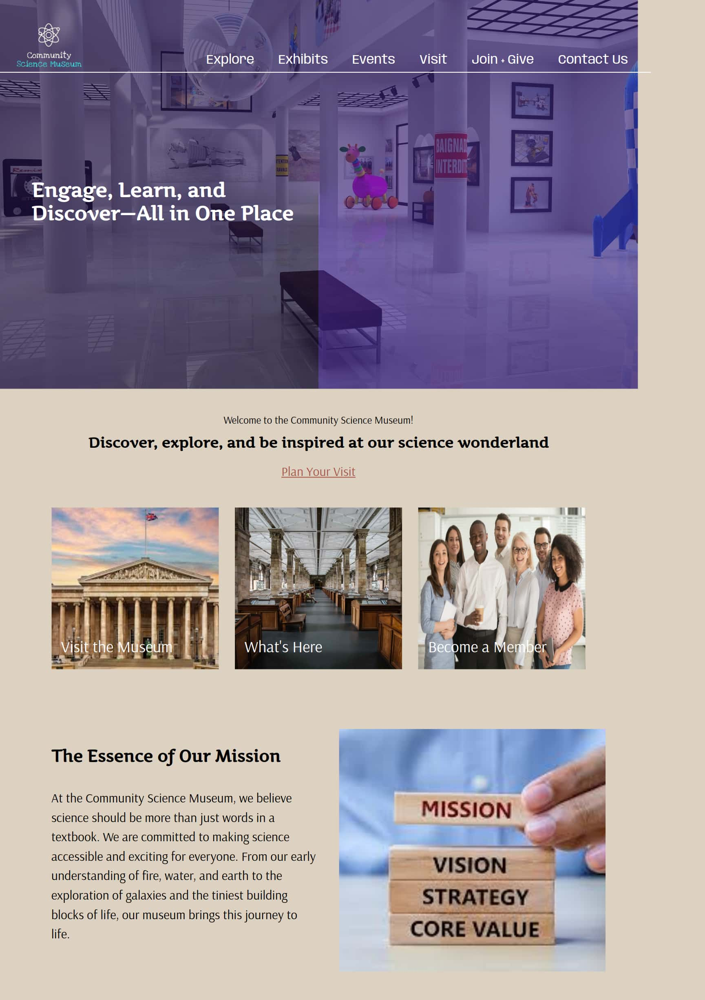

# 🏛️ Community Science Museum

A fictional museum website created to engage young audiences and present science in a fun way.

## 🔗 Live Demo
[View Website](https://shamia702.github.io/semester-project-1/)

## 📂 GitHub Repository
[Semester Project Repo](https://github.com/shamia702/semester-project-1)

## 🛠️ Built With
- HTML
- CSS

## 📌 Features
- Static, responsive layout
- Multiple sections (Home, Exhibitions, Visit Us, etc.)
- Clean and accessible design

## 🧠 Reflection
This was a major project during my first semester. I focused on layout structure, navigation, and accessibility. I now understand how to better manage responsive design and would improve the consistency in spacing and typography.
